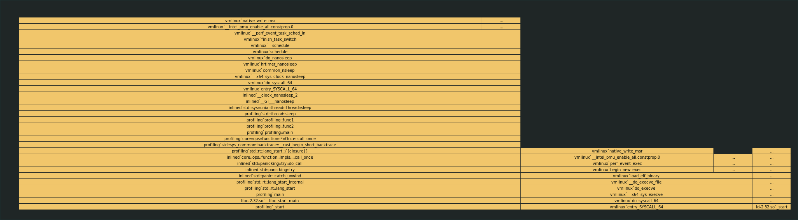
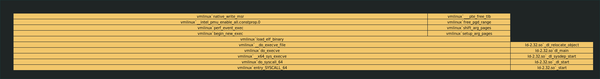

# Profiling

There are multiple possible ways to profile Rust code on Linux.

After building an executable with `cargo build` you can run

```bash
perf record --call-graph=dwarf --freq=997 target/debug/profiling
```

After running the binary you can view a report with:

```bash
perf report --hierarchy -M intel
```

CLion also uses `perf` profiler and builds flamegraph from its output.

Here is what we get after running profiler for example code:



You may notice that `std::thread:sleep` is taking around 60% of all time.

Here is what we get after removing it:



`time` output before optimization:
```
target/debug/profiling  0.00s user 0.00s system 0% cpu 10.004 total
```

`time` output after optimization:
```
target/debug/profiling  0.00s user 0.00s system 84% cpu 0.005 total
```

The difference is that execution takes way less wall clock time. cpu% is higher meaning that more time is spent doing
actual calculations.