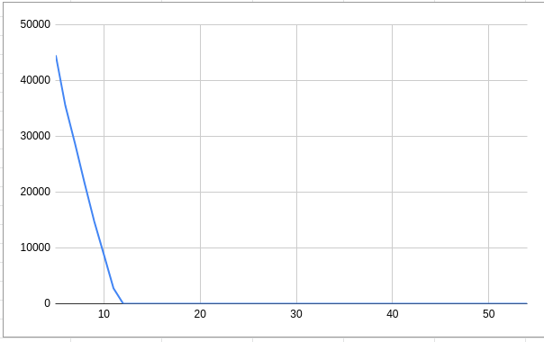
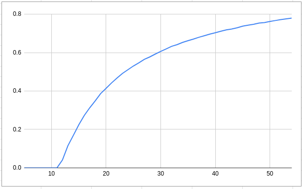
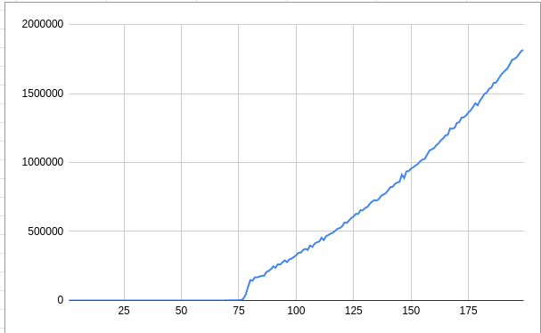

# Scheduler (shortest job first)

This is a relatively simple scheduler which keeps a priority queue of all tasks that have been submitted.
Tasks are prioritized by number of operations estimation.

At each tick, scheduler picks the task with lowest number of operations (shortest job in other words) and keeps it
running until it is completed. After that it picks next job with lowest number of operations and so on until there are
no more tasks to run, when scheduler becomes idle.

See `Task` structure that represents task:
- `id` - id to uniquely identify a task.
- `operations` - operations estimation for this task.
- `remaining_operations` - how many operations until task is completed (1 operation = 1 tick).
- `step()` - run this task for one tick.

See `Scheduler` structure for scheduler:
- `current_task` - the task currently running.
- `queue` - tasks in queue to be run by this scheduler.
- `tick` - tick counter.
- (stats)
- `schedule(task)` - schedule a task.
- `tick()` - pick a task (if there is any) and run it for one tick.

See `run_scheduler_demo(min_time_till_next_schedule, max_time_till_next_schedule, min_ops, max_ops)` in `main.rs` for 
testing this scheduler. First two params are ranges for random intervals between schedules (in ticks), last two - range
for random task operation count.

Wait time by intensity:\

Task ops is [5;25], so at 15 ticks between schedules wait time is < 2.

Idle time by intensity:\

Task ops is [5;25], and percentage of idle time increases as interval between schedules increases.
There is no idle time when interval is less than 10 ticks between schedules on average.

Wait time by task size:\

When there are 15 ticks on average between schedules and task size is [1;200] (random), then tasks with
ops < 75 complete almost instantly, while everything bigger than that queues up.

The disadvantage of this scheduler is that one big task can block all other tasks until it is completed. 